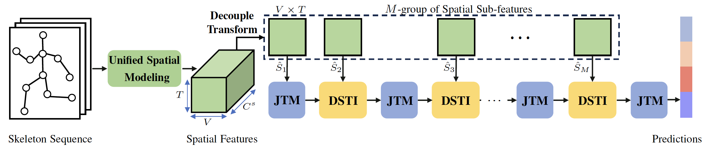

# <p align=center> A Decoupled Spatio-Temporal Framework for <br>Skeleton-based Action Segmentation</p>
> **Authors:**
> Yunheng Li,
> Zhongyu Li,
> Shanghua Gao,
> Qilong Wang,
> Qibin Hou*,
> Ming-Ming Cheng
> (*Corresponding author)

[[paper](https://arxiv.org/pdf/2312.05830.pdf)] [[github](https://github.com/lyhisme/DeST)] [[dataset](https://github.com/lyhisme/DeST/tree/main#Datasets)] [[pretrained models](https://github.com/lyhisme/DeST/tree/main#pretrained-models)] [[Parameter&Flops](imgs/Parameter_Flops.png)] [[visualization](imgs/visualization.png)] 

---

> **Abstract:** *Effectively modeling discriminative spatio-temporal information is essential for segmenting activities in long action sequences. However, we observe that existing methods are limited in weak spatio-temporal modeling capability due to two forms of decoupled modeling: (i) cascaded interaction couples spatial and temporal modeling, which over-smooths motion modeling over the long sequence, and (ii) joint-shared temporal modeling adopts shared weights to model each joint, ignoring the distinct motion patterns of different joints. We propose a Decoupled Spatio-Temporal Framework (DeST) to address the above issues. Firstly, we decouple the cascaded spatio-temporal interaction to avoid stacking multiple spatio-temporal blocks, while achieving sufficient spatio-temporal interaction. Specifically, DeST performs once unified spatial modeling and divides the spatial features into different groups of subfeatures, which then adaptively interact with temporal features from different layers. Since the different sub-features contain distinct spatial semantics, the model could learn the optimal interaction pattern at each layer. Meanwhile, inspired by the fact that different joints move at different speeds, we propose joint-decoupled temporal modeling, which employs independent trainable weights to capture distinctive temporal features of each joint. On four large-scale benchmarks of different scenes, DeST significantly outperforms current state-of-the-art methods with less computational complexity.* 
<p align="center">
     <br />
    <em> 
    Figure 1: Overview of the DeST.
    </em>
</p>

## Introduction
This repo is the official PyTorch implementation for ''A Decoupled Spatio-Temporal Framework for Skeleton-based Action Segmentation''.
> * The skeleton-based action segmentation aims to segment activities in long action sequences.
> * Our proposed DeST is simple yet efficient.
> * A single GPU (NVIDIA RTX 2080 Ti or RTX 3090) can perform all the experiments (average 150 min of training per dataset).


## Dependencies and Installation:
The code requires python>=3.7, as well as pytorch>=1.7 and torchvision>=0.8.

For example:
1. Clone Repository
```bash
git clone https://github.com/lyhisme/DeST.git
```
2. Create Conda Environment and Install Dependencies
```bash
conda env create -f environment.yml
conda activate DeST
```
## Preparation
### Datasets
All datasets can be downloaded from
[GoogleDrive](https://drive.google.com/file/d/1JAX8OaIJQ7ZEaIg61axJoHCw1GZkim9Q/view?usp=sharing) or [BaiduNetdisk](https://pan.baidu.com/s/1PC0Pegpg7tfGyCVjbHbu6w?pwd=mrid). (~4.3GB)


### Pretrained models:

|     Dataset     |   Model    |  F1@10 | F1@25 | F1@50 | Edit | Acc |                           Model Zoo                           |
| :-------------: | :---------:  | :---: | :-----: | :-----: | :-----: | :--: |  :----------------------------------------------------------: |
| MCFS-22 |  DeST (tcn)   |  86.6 |   83.5  |   73.2  | 82.3  | 78.7 | [[Google Drive](https://drive.google.com/drive/folders/105Sm96YJ48w-o8tTvC_2o-jdGm1BhFXd?usp=sharing)] [[BaiduNetdisk](https://pan.baidu.com/s/1Mw7ouaY1PH_NJGkGrHdqSg?pwd=35um)]|
| MCFS-22 | DeST (linearformer) |  87.4 |   84.5  | 75.0  |   85.2  | 80.4 | [[Google Drive](https://drive.google.com/drive/folders/105Sm96YJ48w-o8tTvC_2o-jdGm1BhFXd?usp=sharing)] [[BaiduNetdisk](https://pan.baidu.com/s/1Mw7ouaY1PH_NJGkGrHdqSg?pwd=35um)]|
| MCFS-130 |  DeST (tcn)   |  74.0 |   70.7  |   61.9  | 73.8  | 70.5 | [[Google Drive](https://drive.google.com/file/d/1MqIFntWtTQk3HPiZp8hysI7CQIDTXteS/view?usp=share_link)] [[BaiduNetdisk](https://pan.baidu.com/s/1Mw7ouaY1PH_NJGkGrHdqSg?pwd=35um)]|
| MCFS-130 | DeST (linearformer) |  76.3 |   72.9  | 63.5  |   76.2  | 72.0 | [[Google Drive](https://drive.google.com/drive/folders/105Sm96YJ48w-o8tTvC_2o-jdGm1BhFXd?usp=sharing)] [[BaiduNetdisk](https://pan.baidu.com/s/1Mw7ouaY1PH_NJGkGrHdqSg?pwd=35um)]|
| PKU-MMD (sub) |  DeST (tcn)   |  71.7 |   68.0  |   55.5  | 66.3  | 67.6 | [[Google Drive](https://drive.google.com/file/d/1MqIFntWtTQk3HPiZp8hysI7CQIDTXteS/view?usp=share_link)] [[BaiduNetdisk](https://pan.baidu.com/s/1Mw7ouaY1PH_NJGkGrHdqSg?pwd=35um)]|
| PKU-MMD (sub) | DeST (linearformer) |  75.3 |   72.2  | 60.2  |   70.5  | 70.8 | [[Google Drive](https://drive.google.com/drive/folders/105Sm96YJ48w-o8tTvC_2o-jdGm1BhFXd?usp=sharing)] [[BaiduNetdisk](https://pan.baidu.com/s/1Mw7ouaY1PH_NJGkGrHdqSg?pwd=35um)]|
| PKU-MMD (view) |  DeST (tcn)   |  63.2 |   59.2  |   47.6  | 58.2  | 62.4 | [[Google Drive](https://drive.google.com/file/d/1MqIFntWtTQk3HPiZp8hysI7CQIDTXteS/view?usp=share_link)] [[BaiduNetdisk](https://pan.baidu.com/s/1Mw7ouaY1PH_NJGkGrHdqSg?pwd=35um)]|
| PKU-MMD (view) | DeST (linearformer) |  69.3 |   65.6  | 52.0  |   64.7  | 67.3 | [[Google Drive](https://drive.google.com/drive/folders/105Sm96YJ48w-o8tTvC_2o-jdGm1BhFXd?usp=sharing)] [[BaiduNetdisk](https://pan.baidu.com/s/1Mw7ouaY1PH_NJGkGrHdqSg?pwd=35um)]|
| LARA |  DeST (tcn)   |  69.7 |   66.7  |   55.8  | 63.7  | 72.6 | [[Google Drive](https://drive.google.com/file/d/1MqIFntWtTQk3HPiZp8hysI7CQIDTXteS/view?usp=share_link)] [[BaiduNetdisk](https://pan.baidu.com/s/1Mw7ouaY1PH_NJGkGrHdqSg?pwd=35um)]|
| LARA | DeST (linearformer) |  70.3 |   68.0  | 57.8  |   64.2  | 75.1 | [[Google Drive](https://drive.google.com/drive/folders/105Sm96YJ48w-o8tTvC_2o-jdGm1BhFXd?usp=sharing)] [[BaiduNetdisk](https://pan.baidu.com/s/1Mw7ouaY1PH_NJGkGrHdqSg?pwd=35um)]|


Orgnize the checkpoints and dataset folder in the following structure (**Note**: please check it carefully):
```
|-- config
|   |-- DeST_linearformer
|   |   |-- MCFS-130
|   |   |   `-- config.yaml
├─ dataset
|   |-- MCFS-130
|   |   |-- features/
│   |   |-- groundTruth/
│   |   |-- gt_arr/
│   |   |-- gt_boundary_arr/
│   |   |-- splits/
|   |   |-- mapping.txt
|-- csv/
|-- result
|   |-- MCFS-130
|   |   |-- DeST_linearformer
|   |   |   |-- split1
|   |   |   |   `-- best_test_model.prm
|-- train.py
|-- evaluate.py
|-- libs/
|-- save_pred.py
`-- utils/
```

## Get Started

### Training

You can train a model by changing the settings of the configuration file.
```shell
python train.py ./config/xxx/xxx/config.yaml
```
Example:
```shell
python train.py ./config/DeST_linearformer/MCFS-130/config.yaml
```
### Evaluation
You can evaluate the performance of result after running.
```shell
python evaluate.py ./config/xxx/xxx/config.yaml
```
Example:
```shell
python evaluate.py ./config/DeST_linearformer/MCFS-130/config.yaml 
```

### average cross validation results
```shell
python utils/average_cv_results.py [result_dir]
```
Example:
```shell
python utils/average_cv_results.py ./result/MCFS-130/DeST_linearformer/
```
## Citation

If you find our repo useful for your research, please consider citing our paper:

```bibtex
@article{DeST,
  title={A Decoupled Spatio-Temporal Framework for <br>Skeleton-based Action Segmentation},
  author={Yunheng Li, Zhongyu Li, Shanghua Gao, Qilong Wang, Qibin Hou, Ming-Ming Cheng},
  journal={arXiv preprint arXiv:2312.05830},
  year={2023}
}
```

## Acknowledgement

Our work is closely related to the following assets that inspire our implementation. We gratefully thank the authors. 

- MS-G3D:  https://github.com/kenziyuliu/MS-G3D
- ASRF:  https://github.com/yiskw713
- asrf_with_asforme:  https://github.com/ChinaYi/asrf_with_asformer
- MS-TCN https://github.com/yabufarha/ms-tcn
- Linear-Transformer https://github.com/xyltt/Linear-Transformer

<!-- We appreciate [MS-TCN](https://github.com/yabufarha/ms-tcn) for backbone network and evaluation code.

Appreciating [Yuchi Ishikawa](https://github.com/yiskw713 ) shares the re-implementation of [MS-TCN](https://github.com/yiskw713/ms-tcn) with pytorch. -->

## License
Licensed under a [Creative Commons Attribution-NonCommercial 4.0 International](https://creativecommons.org/licenses/by-nc/4.0/) for Non-commercial use only.
Any commercial use should get formal permission first.

## Contact
If you have any other questions, please email yunhengli AT mail.nankai.edu.cn and I typically respond within a few days.